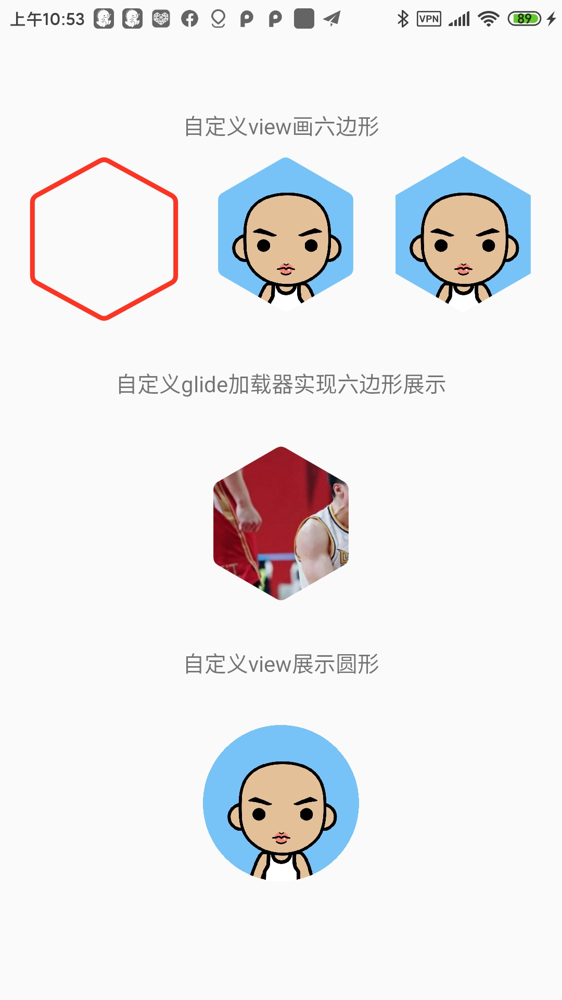

# 这是我的一个仓库工程
在自己的工程里面想要使用的话方式如下：
在根build.gradle里面添加：

```
// Top-level build file where you can add configuration options common to all sub-projects/modules.
buildscript {
    ext.kotlin_version = "1.4.10"
    repositories {
        google()
        jcenter()
        //这是要添加的内容
        maven { url "https://jitpack.io" }
        maven{
            url 'https://raw.githubusercontent.com/1169927533/BaseMavenProject/master'
        }
        //----------------

    }
    dependencies {
        classpath "com.android.tools.build:gradle:4.2.0-alpha13"
        classpath "org.jetbrains.kotlin:kotlin-gradle-plugin:$kotlin_version"
        
        classpath 'com.github.dcendents:android-maven-gradle-plugin:2.1'
         //这是要添加的内容
        classpath 'com.pince.gradle_plugin:versionplugin:1.0.0'
        //----
    }
}

allprojects {
    apply plugin:'com.pince.gradle_plugin'
    repositories {
        google()
        jcenter()
        //这是要添加的内容
        maven { url "https://jitpack.io" }
        maven{
            url 'https://raw.githubusercontent.com/1169927533/BaseMavenProject/master'
        }
         //----

    }
}
```

## 新增展示六边形的自定义view

效果：



```
 <!--六边形-->
    <declare-styleable name="hexagon">
        <attr name="sixStroke" format="dimension" /><!--线条宽度-->
        <attr name="sixXColor" format="color" /><!--线条颜色-->
        <attr name="sixAngle" format="dimension" /><!--线条圆角弧度-->
        <attr name="isFill" format="boolean" /><!--是填充吗-->
        <attr name="loadNetImg" format="boolean" /><!--是否去加载网络图片-->
    </declare-styleable>
```
当我们需要加载网络图片的时候需要按照以下格式进行书写：
```xml
    <com.example.a11699.comp_customview.pentagonal.PentagonalView
        android:id="@+id/glideurl"
        android:layout_width="100dp"
        android:layout_height="100dp"
        android:src="@drawable/avatar_rengwuxian" <!--这个图事图片请求失败的时候进行展示的图片-->
        app:sixAngle="3dp"  <!--画笔的圆润度-->
        app:isFill="true"   <!--必须设置为填充-->
        app:loadNetImg="true" <!--模式设置为加载图片 默认不是加载图片的模式-->
        app:sixXColor="#ff32"<!--线条的颜色当模式为图片的时候可以不用加--> />
```

只需要展示一个view用以下方式：

```xml
 <!--就只绘制一个六边形-->
 <com.example.a11699.comp_customview.pentagonal.PentagonalView
        android:id="@+id/pentview"
        android:layout_width="100dp"
        android:layout_height="100dp"
        app:isFill="false"
        app:loadNetImg="false"
        app:sixStroke="3dp"
        app:sixAngle="3dp"
        app:sixXColor="#ff32" />
```
不想下载源码的话直接添加远程依赖就可以用：
 ```
 allprojects {
        repositories {
            ...
            maven { url 'https://jitpack.io' }
        }
    }
dependencies {
            implementation 'com.github.1169927533.BaseMavenProject:module_customview:1.4.1'
    }
 ```
